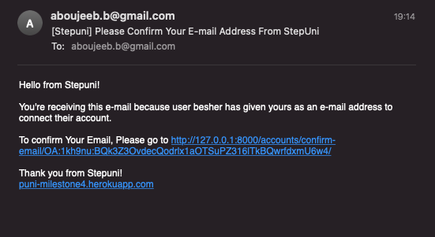
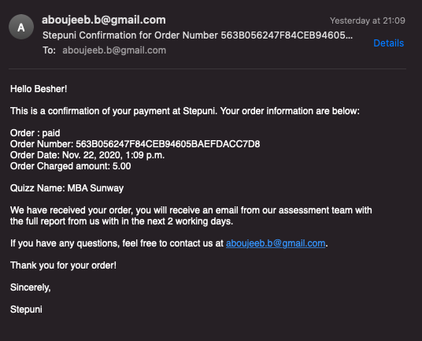

All testing cases has been done manually and below are the deatils:     

# UI Testing:
## NavBar:
### Without login:
* Click on Stepuni logo to go to main page.
* Click on My Account button will show you 2 options (login, sign up)
* Click on login will direct to login page.
* Click on Sign up will direct to Sign up page.
### Logged in as user:
* Click on Stepuni logo to go to Quizz List
* Click on My Account button will show 7 options (Quizzes List,Billing Information, Order History, My Quizzes, Change My Password, Change Your Email, Logout).
* Click on Quizzes List will direct to Quizzes List page.
* Click on Billing Information will direct to Billing Information page.
* Click on Order History will direct to Order History page.
* Click on My Quizzes will direct to My Quizzes page.
* Click on Change My Password will direct to Change My Password page.
* Click on Change Your Emailp will direct to Change Your Email page.
* Click on Logou will direct to Logou page.
### Logged in as Admin:
* Click on Stepuni logo to go to Quizz List
* Click on My Account button will show 8 options (Add Quiz!, Quizzes List,Billing Information, Order History, My Quizzes, Change My Password, Change Your Email, Logout).
* Click on Add Quiz! will direct to Add Quiz! page.
* Click on Quizzes List will direct to Quizzes List page.
* Click on Billing Information will direct to Billing Information page.
* Click on Order History will direct to Order History page.
* Click on My Quizzes will direct to My Quizzes page.
* Click on Change My Password will direct to Change My Password page.
* Click on Change Your Emailp will direct to Change Your Email page.
* Click on Logout will direct to Logout page.

## Main Page:
* Click on Sign up! button in the hero image will direct to Sign up page.
* Click on Sign up! button in the bottom of the page will direct to Sign up page.

## Sign Up Page:
* Click on Back to Login beside the Sign Up button will direct to Login page.
* Fill Email field is required.
* Fill Username Field is required.
* Password Field is required.
* Confirm password is required.
* Fill all required form will lead to Email verification page.
* Any mising Field will ask to fill the required field.
* Username should be at least 4 character.
* Password should be least 8 character.

## Login Page:
* Click on sign up link will direct to Sign Up page.
* Click on Home link will direct to Main page.
* Click on forgot password link will direct to forgot password page.
* Fill in Existing username and password will direct to Quiz list. 
* If username or password dosent match the original signup form will return "The username and/or password you specified are not correct."
* If user not verified Email once login will return to "Email verification page".

## Forgot Password Page:
* Fill in the email and click on "Reset My Password" will return "We have sent you an e-mail. Please contact us if you do not receive it within a few minutes."
* If the email not exist will return "The e-mail address is not assigned to any user account."
* If click on Back to Login will direct to Login Page.

## Quizz List:
### User:
* Toast massage appear login successful.
* If User already purchased the service will see "Start Quizz!" Button and will direct to Quizz.
* If User not purchased the service will see "checkout!" Button and will direct to Checkout Page.
### Admin:
* Toast massage appear login successful.
* If User already purchased the service will see "Start Quizz!" Button and will direct to Quizz.
* If User not purchased the service will see "checkout!" Button and will direct to Checkout Page.
* Click on "Edit The Quizz" will direct to Edit Quiz Page.
* Click on "Delete The Quizz" will direct to Alert "Are you sure?" if respond with "OK" the Quiz will be Deleted and if respond with "Cancel" will return to the current page.

## Edit the Quiz:
* Toast massage appear edit the quizz.
* The original quiz information will be in the form fields.
* Name field is required, Description Field is required, Image is required, Quizz is required, Sku is Optional, if update without filling required fields will return "please fill in the 'required' field".
* Once all Required Fields filled click on Update Quizz will direct to Quiz List page with toast "Updated Successfully".
* Click on Cancel will return to Quiz List page.

## Add Quizz:
* Name field is required, Description Field is required, Image is required, Quizz is required, Sku is Optional, if update without filling required fields will return "please fill in the 'required' field".
* Once all Required Fields filled click on Add Quizz will direct to Quiz List page with toast message "Successfully added !".
* Click on Cancel will return to Quiz List page.

## Checkout:
* (Full Name, Email Address, Phone Number, Street Address 1, Town or City, Country) all required fields and if any missing will be asked to add once click on  "Make the Order"
* Check the box "Save this Billing information to my profile" will save all the enetered information in "Billing Information" Page.
* Stripe Test Card Number "4242424242424242 04 24 242"
* Click on "Make the Order" screen will turn to green then will redirect to "Check out Success Page"
* Fill random number in card or validity or CVC number will turn red and return " Your card number is invalid."

## Checkout Success:
* Click on "Check My Quizzes" will direct to "My Quizzes" Page.
* Click on "BACK TO ORDER HISTORY" will direct to "Order History" Page.

## Billing Information:
* No Field Required, click on Update Information and will save the enetered fields.
* Click on Cancel will direct to Quiz List Page.

## Order History:
* Click on Order Number will direct to order details.
* Click on "Back to order new quizzes" will direct to Quiz List Page.
* If there is no Order will show " You don't have any orders yet! "

## My Quizzes:
* Click on "Start Quizz" will direct to Quiz page.
* if there is No Purchased Quizzes will show "You don't have any quizzes ordered yet"

## Quizz Page:
* Fill the form provided by Google Forms, all fields required.
* If a field is not filled will return "This is a required question"
* Click on " Back to My Quizzess!" will direct to "MY Quizzes" Page.
* If leaving the page with out complete or submit the quiz will return "Leave site? Changed that you made may not be saved"

## Change Password:
* All Field are required and if one not filled will return "Please fill in this field"
* If password not 8 charecters will return "This password is too short. It must contain at least 8 characters."
* If New Password and New Password (again) not match will return "You must type the same password each time."
* If Current password is not correct will return "Please type your current password."
* If Current password correct and new password and new password (again) both same and at least 8 characters will return " Password successfully changed."
* Click on "Back to My Account" will direct to "Quiz List" Page.

## Change Email:
* If only have one Email and click on "remove" will return "You cannot remove your primary e-mail address 'email'".
* If Click on "Make Primary" will return " Primary e-mail address set. " .
* if Click on "Re-send Verification" will return "Confirmation e-mail sent to 'email'.".
* Fill email and click on "Add Email" will add new email Unverified and will show toast "Confirmation e-mail sent to 'new email'".
* Click on "Remove" and will Remove email with toast message "Removed e-mail address 'email'.".
* Click on "Add email" with out filling any email will return "Please Fill in this field"
* Click on "Add email" and fill any format other than email format will return "please inlcude @ in the email address"

## Logout:
* Click on "Sign Out" will direct to main page.
* Click on "cancel" will direct to "Quiz List" Page.

# Responsivness:
The design was tested using chrome devtools for the following devices:
* Responsive (googlechrome dev tools).
* Moto G4.
* Galaxy S5.
* Pixel 2.
* Pixel 2 XL.
* Iphone 5/SE.
* Iphone 6/7/8.
* Iphone 6/7/8 Plus.
* Iphone X .
* Ipad.
* Galaxy Fold.
* Surface Duo.

# Email Verification:
## Signup Email Verification:

## Order Confirmation:

